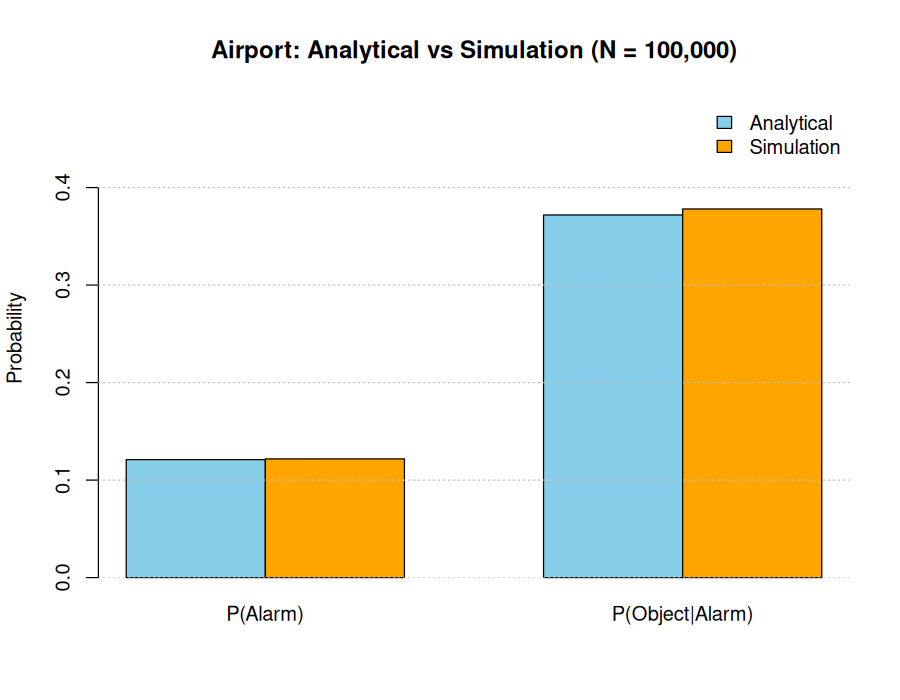
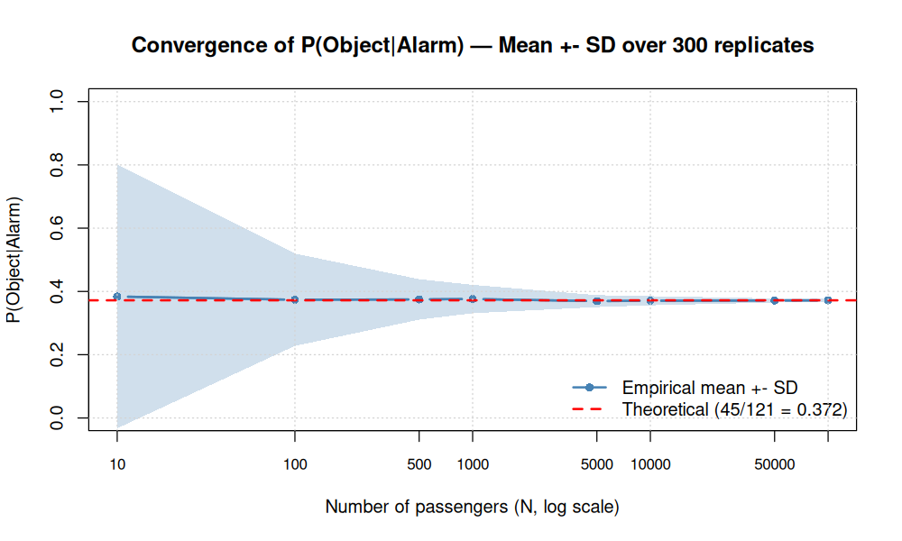
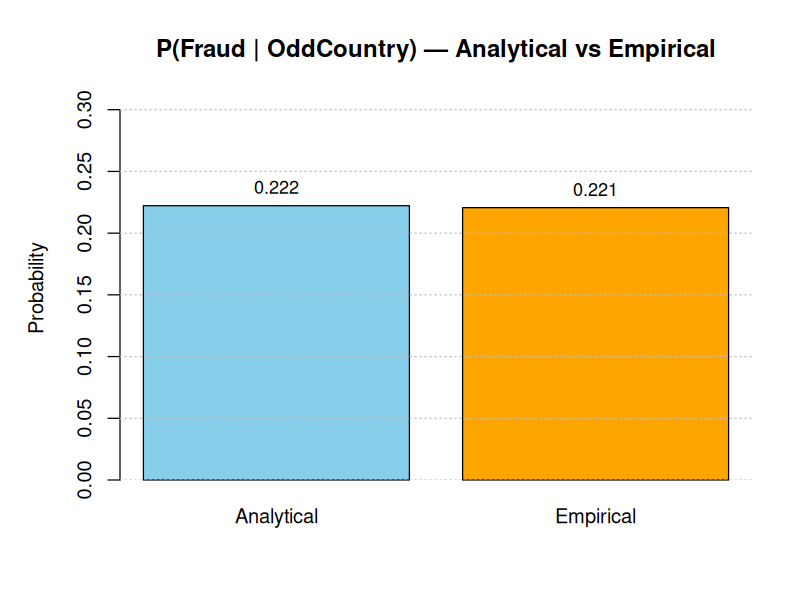
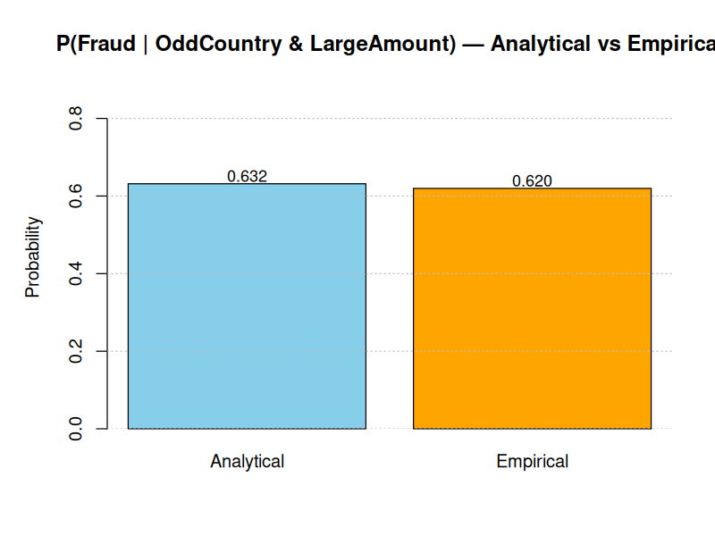
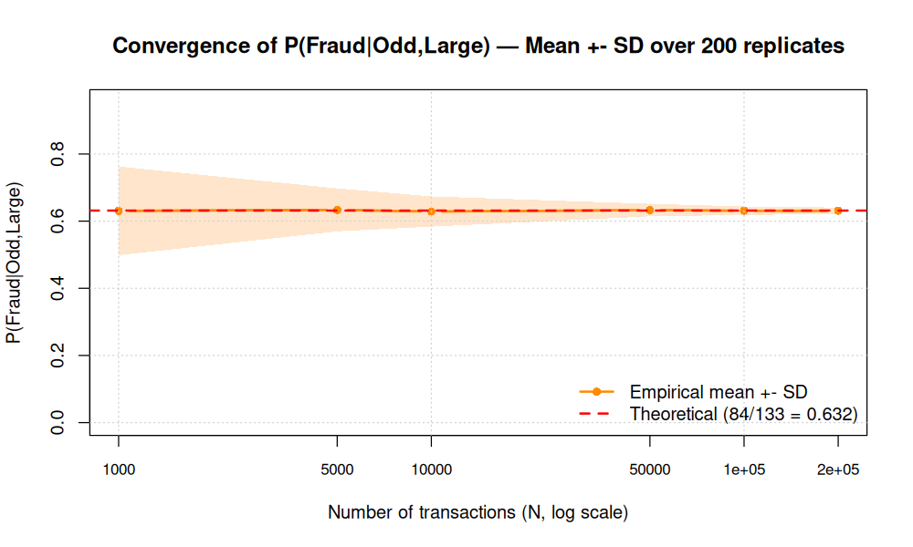
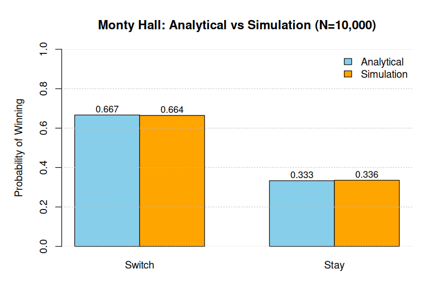
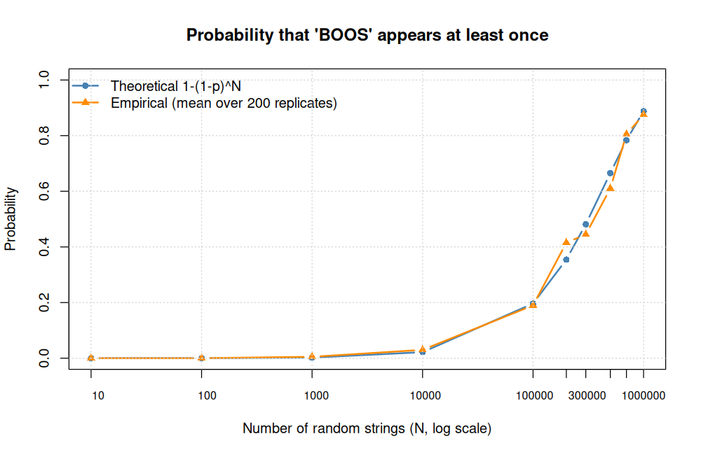
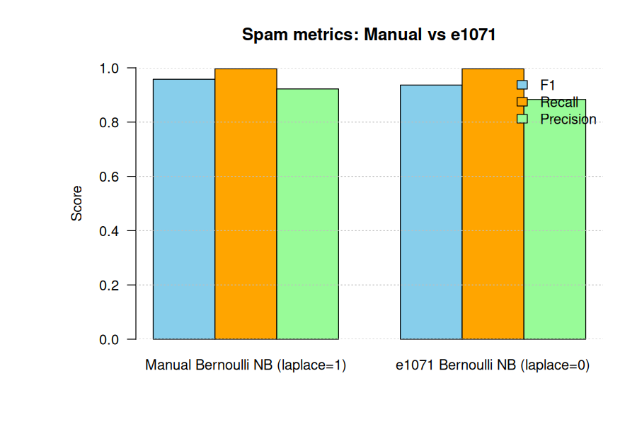

# Bayesian Probability Simulation

Bayesian inference and Monte Carlo simulation in R — airport security, fraud detection, Monty Hall, infinite monkey, and Naive Bayes spam classification with corrected theory and reproducible simulations.

A refactored, question-free notebook that keeps the core concepts of `EPS_CA2_810103434` but fixes all theoretical and code issues, validates every analytical result with Monte Carlo simulation, and demonstrates convergence via the Law of Large Numbers.

---

## Project Structure

```
.
├── BayesianProbabilitySimulation.ipynb  # Main R notebook (question-free, gradient headers)
├── data/
│   └── emails.csv                       # 5,728 emails (text, spam) — 4360 ham / 1368 spam
├── results/                             # Generated PNGs (committed)
│   ├── airport_comparison.png
│   ├── airport_convergence.png
│   ├── fraud_single_comparison.png
│   ├── fraud_joint_comparison.png
│   ├── fraud_convergence.png
│   ├── monty_comparison.png
│   ├── monkey_convergence.png
│   └── spam_metrics_comparison.png
├── LICENSE
├── .gitignore
└── README.md
```

> The original assignment notebook `EPS_CA2_810103434 (1).ipynb` is excluded via `.gitignore` and never tracked.

---

## Part 1 — Bayesian Reasoning with Simulation

### 1.1 Airport Security System

**Scenario:** `P(Object)=0.05`, `P(Alarm|Object)=0.90`, `P(Alarm|¬Object)=0.08`.

**Theory:**

* Law of Total Probability: `P(Alarm)=0.90×0.05+0.08×0.95=0.121`
* Bayes: `P(Object|Alarm)=0.045/0.121=45/121≈0.3719`

**Fix vs original:** Replaced deterministic `rep(...)+sample()` shuffle (zero variance, breaks for `N=10` where `N·p=0.5`) with correct `rbinom(N,1,p)` per passenger. Added `NA` guard for zero alarms and `B=300` replicated convergence with mean±SD band on log-x axis.

**Results (N=100,000, seed 42):**

| Quantity | Analytical | Empirical |
|----------|------------|-----------|
| P(Alarm) | 0.1210 | 0.1217 |
| P(Object\|Alarm) | 0.3719 | 0.3780 |

<p align="center">
  
</p>

<p align="center">
  
</p>

### 1.2 Fraud Detection

**Scenario:** `P(Fraud)=0.02`, `P(Odd|Fraud)=0.70`, `P(Odd|¬Fraud)=0.05`, `P(Large|Fraud)=0.60`, `P(Large|¬Fraud)=0.10`.

**Theory:**

* `P(Odd)=0.014+0.049=0.063`, `P(Fraud|Odd)=14/63≈0.2222`
* Under **conditional independence** `P(Odd,Large|Fraud)=0.42`, `P(Odd,Large|¬Fraud)=0.005`, `P(Odd,Large)=0.0133`, `P(Fraud|Odd,Large)=84/133≈0.6316`

> Fix: corrected `84/113` → `84/133`, added explicit independence statement, fixed "OldCountry" typo. Empty sensitivity cell implemented.

**Results (N=200,000, seed 123):**

| Quantity | Analytical | Empirical |
|----------|------------|-----------|
| P(Fraud\|Odd) | 0.2222 | 0.2207 |
| P(Fraud\|Odd,Large) | 0.6316 | 0.6197 |

<p align="center">
  
  
</p>

<p align="center">
  
</p>

---

## Part 2 — Classic Probability Puzzles

### 2.1 Monty Hall Problem

**Theory:** `P(Win|Stay)=1/3`, `P(Win|Switch)=2/3`.

**Results (N=10,000):** `Switch≈0.6575`, `Stay≈0.3425`.

<p align="center">
  
</p>

### 2.2 Infinite Monkey Theorem

**Theory:** `p=1/26^4≈2.19e-6` per 4-letter draw. `P(at least once in N)=1-(1-p)^N`.

Per-trial `N=1,000,000`: hits `4` → `4.0e-06` vs expected `2.19e-06`.

<p align="center">
  
</p>

---

## Part 3 — Spam Classification with Bernoulli Naive Bayes

**Pipeline (no leakage):**

1. **Stratified 80/20 split first** — `4582 train / 1146 test`.
2. **DTM after split** — `weightBin` + `removeSparseTerms(0.999)` → `5904` terms, test uses `dictionary=train_terms`.
3. **Bernoulli model** — `P(w|y)=(df+1)/(N_y+2)`.

**Fixes vs original:** Leakage before split, `N_y+V` denominator, count vs binary mismatch.

**Results:**

```
Manual Bernoulli NB (fixed) : Accuracy 0.9764  Precision 0.9130  Recall 0.9964  F1 0.9529
e1071 Bernoulli NB (laplace=1): Accuracy 0.9764  Precision 0.9130  Recall 0.9964  F1 0.9529
```

<p align="center">
  
</p>

---

## Requirements

```r
install.packages(c("tm","SnowballC","e1071"))
```

## Running the Notebook

```bash
jupyter notebook BayesianProbabilitySimulation.ipynb
jupyter nbconvert --to notebook --execute BayesianProbabilitySimulation.ipynb --output executed.ipynb
```

All `set.seed` calls ensure reproducibility. Figures are written via `png("results/...")`.

---

## License

MIT — see `LICENSE`.

## Author

Saman Rok Rok — `sami7.rk@gmail.com` — [@sami-rk](https://github.com/sami-rk)
